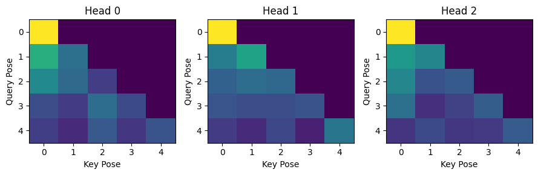

# Output of the cmd

## Multi-head Attention Layer Logs

```text
Input X : (1, 5, 12) = (B, T, model_dim)
Linear qkv(x) : (1, 5, 36) = (B, T, 3 * model_dim)
View to 5D : (1, 5, 3, 3, 4) = (B, T, 3, heads, head_dim) 
-----------
Q, K, V split : 
Q = (1, 5, 3, 4) 
K = (1, 5, 3, 4) 
V = (1, 5, 3, 4) 
----------
Transpose heads: 
Q = (1, 3, 5, 4) 
K = (1, 3, 5, 4) 
V = (1, 3, 5, 4) 
(B, heads, T, head_dim) 
----------
Scores Q @ K^t : (1, 3, 5, 5) = (B, heads, T, T)
Weights(softmax) : (1, 3, 5, 5) = (B, heads, T, T)
context @ v : (1, 3, 5, 4) = (B, heads, T, head_dim)
Merge heads : (1, 5, 12) = (B, T, model_dim)
Final Proj  : (1, 5, 12) = (B, T, model_dim)
---------
Legend:

B is batch 
T is sequence length 
model_dim is Embedding size 
n_head is number of Heads 
head_dim is model_dim / n_head
QKV(x) is a single linear producing [Q|K|V]; 
We reshape then split into Q, K, V

```

## Causal Mask Grid representation

